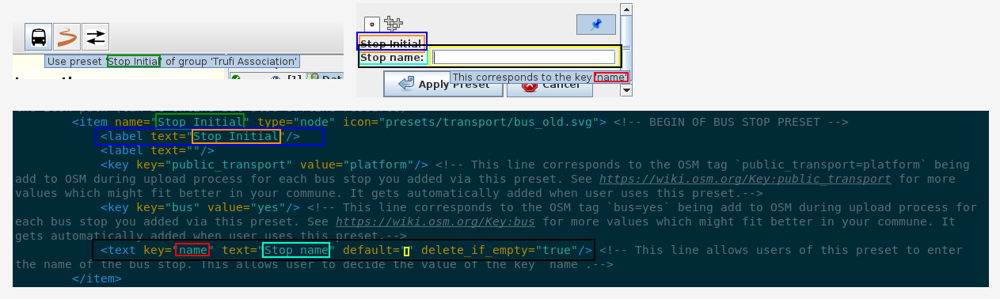
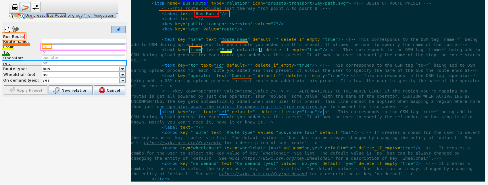
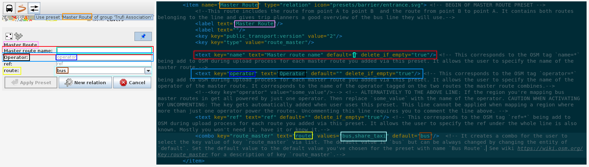

# routemapping_josmconfig

This repository contains the necessary files to make it easier for you to actually concentrate on mapping (bus) routes via JOSM. It is a project for Trufi Association.


# Good to know

This repository contains the necessary files needed to make bus route mapping in JOSM even better. It does not contain JOSM itself but you can download JOSM for Linux, Mac or Windows from [here](https://josm.openstreetmap.de).

> **What is JOSM?**
> 
> JOSM is an extensible editor for [OpenStreetMap](https://welcome.openstreetmap.org/what-is-openstreetmap/). OpenStreetMap itself is a project to create a free and editable map for anyone by anyone. JOSM is a highly advantage tool to actually contribute to OSM by letting you add objects that represent real world objects to the database.

The documentation does not explain how to [set up JOSM](https://github.com/ValorNaram/trufi_documentation/blob/master/installing-josm-on-linux/installing-josm-linux.md) nor to [link it to your OSM account](https://github.com/ValorNaram/trufi_documentation/blob/master/oauth-josm/oauth-josm.md) but it explains how to tweak JOSM to make it easier to [add bus routes to OSM](https://github.com/ValorNaram/trufi_documentation/blob/master/mapping-routes/mapping-routes.md). JOSM itself is complicated enough so we decided to simplify it for our purpose. Our guidelines will show how do you tweak our tool to suit your needs.

## Prequesites

We recommend you to have a (basic) understanding of OpenStreetMap and its tagging schematics. It does not matter, if you ever worked with JOSM - the editor - or not. We have also set up a [documentation on how to set up JOSM and how to actually map bus routes](https://github.com/ValorNaram/trufi_documentation/blob/master/README.md) via JOSM.

# Changing our tool to suit your needs

Before you even start to distribute our tool to your community you need to tweak it to suit the needs of your community.

## Prepare your workplace

1. Juat concentrate on our tutorial. Don't listen to music and do not another unrelevant stuff.

2. Fork this repository

3. Clone this repository onto your computer

4. Change into the newly created folder

## Editing `trufi_presets.xml`

This is actually the really important part which will also take the most time.

1. Open XML file `trufi_presets.xml`.

2. The file is documented. You should understand it. But here are some aspects good to know. The following three images show you the schematics of UI creation in preset means. It shows you which part of the preset code does which part of the UI. Study the images carefully:
   
   
   
   3. A good another way of understanding the file is by understanding its schematics.
      
      ```xml
      <presets author="Author name" link="Url to project this file is for" shortdescription="Short description of what this preset file allows you to do" description="Longer description of what this preset file allows you to do"> <!-- Description of the presets this file contains. This is metadata that is equal for every preset specified in here.-->
          <group name="Name of group" icon="Url to the online resource containing the icon"> <!-- Presets can be grouped to add extra metadata only to preset inside of it -->
              <item name="Name of the preset" type="osm type for which this preset can be used. Seperate multiple types by comma. Supported osm types are 'node', 'way', 'relation'." icon="url to preset icon">
                  <label text="Label 1" /> <!-- It creates a label (read-only text container) in the preset dialog with the content "Label 1"-->
                  <key key="public_transport" value="platform"/> <!-- Tells JOSM to apply the OSM tag "public_transport=platform" to the object this preset is used on. The user cannot prevent that.-->
                  <text key="name" text="Stop name" default="" delete_if_empty="true" /> <!--This shows a textfield prompting the user to specify the value of OSM key "name".-->
                      <!-- XML attribute `key`: The key the user can specify a value for -->
                      <!-- XML attribute `text`: The text to be shown to the user so he/she knows for what he/she is prompted to type in. -->
                      <!-- XML attribute `default`: The default value of the key to apply when the user does not type anything into the textfield. -->
                      <!-- XML attribute `delete_if_empty`: Can have the values "true" (JOSM will not apply the key to the preset when the user did not type anything (leaving the textfield empty)) and "false" (JOSM will also apply the key to the preset when the user did not type anything into the textfield. The value for XML attribute `default` will be applied instead.)-->
                  <combo key="wheelchair" text="Wheelchair accessible?" values="no, yes" default="no" delete_if_empty="true"/> <!-- This shows a combo box (select from a predefined list of values) to the user prompting to decide which value to take for key "wheelchair". -->
                      <!-- XML attribute `key`: The key the user can specify a value for -->
                      <!-- XML attribute `text`: The text to be shown to the user so he/she knows for what he/she is prompted to select a value for. -->
                      <!-- XML attribute `values`: A comma seperated list of values the user can select from. This is the list which will be shown to the user. -->
                      <!-- XML attribute `default`: The default value of the key to apply when the user does not select anything from the list. -->
                      <!-- XML attribute `delete_if_empty`: Can have the values "true" (JOSM will not apply the key to the preset when the user did not type anything (leaving the textfield empty)) and "false" (JOSM will also apply the key to the preset when the user did not select anything from the list. The value for XML attribute `default` will be applied instead.)-->
              </item>
          </group>
      </preset>
      ```
      
      
   
   ## Preparing preset for production use.
   
   1. Compress the XML file `trufi_presets.xml` into a zip archive.
   
   2. Upload the zip file to the repository on GitHub.
   
   3. Go to GitHub
   
   4. Go to the online repository.
   
   5. Click on the file you uploaded in step 2.
   
   6. Copy the hotlink of the file into your clipboard.

## Editing `josmconfig-trufi-routes.xml`

The XML contains the configuration for JOSM and the plugins to be installed. Editing it is pretty easy because we've done the most work for you.

1. Open XML file `josmconfig-trufi-routes.xml` .

2. Search for the line that looks like:
   
   ```xml
   <tag key="url" value="https://github.com/SamuelRioTz/Trufi-Presets/releases/download/v1.0.5/trufi.zip"/>
   ```

3. Change the value `https://github.com/SamuelRioTz/Trufi-Presets/releases/download/v1.0.5/trufi.zip` to the url pointing to the zip file you uploaded into your repository on GitHub by inserting the new value from your clipboard e.g. `https://github.com/ValorNaram/routemapping_josmconfig/raw/master/trufi_presets.zip`

4. Save your work and close your text editor.

## Finalization

Upload all your changes to the forked GitHub repository and follow the tutorial [here](https://github.com/ValorNaram/trufi_documentation/blob/master/installing-mapping-tool/install-bus-routes-mapping-tool.md) in order to activate your customized version of our tool in JOSM. Distribute the customized file `josmconfig-trufi-routes.xml` (not our original one) and nothing else to your community. Point them also to the tutorial on [how to install your customized version of our tool for mapping bus routes in JOSM](https://github.com/ValorNaram/trufi_documentation/blob/master/installing-mapping-tool/install-bus-routes-mapping-tool.md) so they know what to do. You should also consider pointing them to [our comprehensive guide on using JOSM for mapping bus routes](https://github.com/ValorNaram/trufi_documentation/blob/master/README.md).


